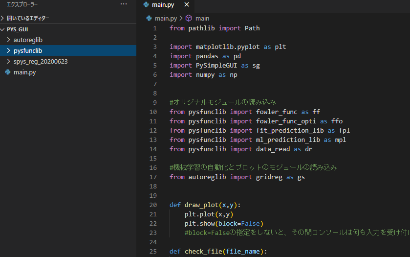
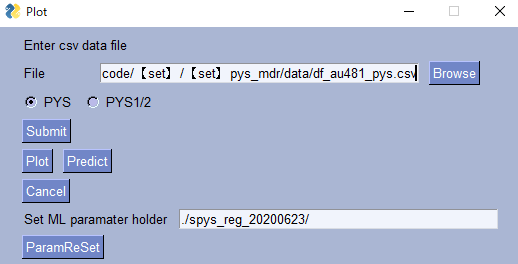
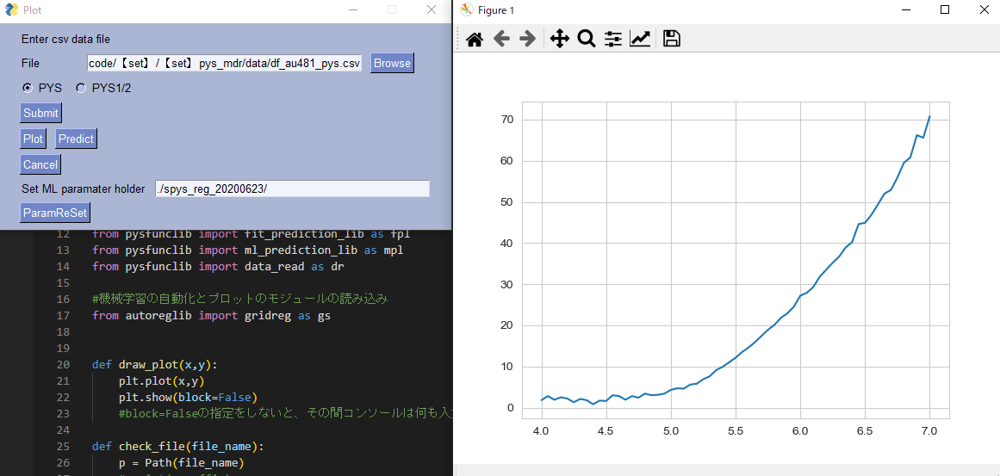
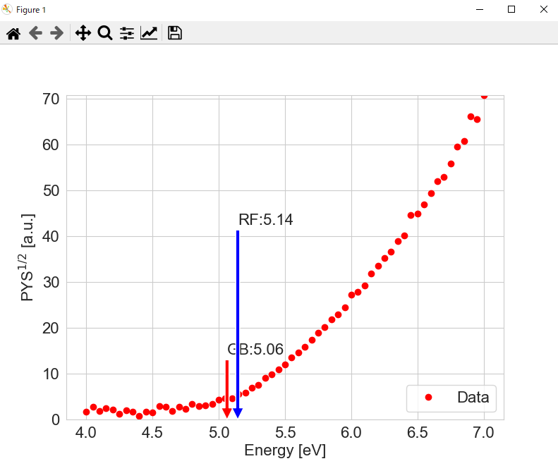

## 「機械学習による光電子収量分光（PYS） スペクトルの自動閾値予測」論文の付属データ

光電子収量分光（PYS）における、閾値予測のプログラムコード・機械学習パラメータ・検証データを公開します。
論文「機械学習による光電子収量分光（PYS） スペクトルの自動閾値予測」：https://doi.org/10.1380/vss.63.270

ここに公開されているプログラムは、既に公開されているリポジトリのものをベースに修正が加えられています。
https://mdr.nims.go.jp/concern/publications/v979v408s?locale=en

### PYS論文に使われたプログラム・データ

（1）Fowler解析関数より計算データ（教師データセット）作成

（2）計算データの機械学習

（3）測定データによる検証

この他に、

（4）検証データ　Excel

（5）機械学習のパラメータファイル

##### Directry構成

    autoreglib
    pysfunclib
    data---df_au481_pys.csv
        ---validation_data_MDR.xlsx
        ---validation_data_MDR_results.xlsx
    spys_reg_20200623
    reg_data_model-making.ipynb
    validation.ipynb
    ml_fit_prediction.ipynb
    data_range_madify.ipynb
    main.py

添付ファイルの説明
（1）-（3）に使われる共通コードは、2つのモジュールにまとめられています。

pysfunclib :PYSの計算式、最適化関数、グラフ描画などプログラム

autoreglib：Scikit-learnモジュールをいくつか組み合わせて、学習からグリッドサーチ、描画まで機械学習を自動化したプログラム

計算の実際 (Jupyter notebook形式)（計算結果が載っているもの）

reg_data_model-making.ipynb：計算データの作成と機械学習

validation.ipynb：測定データ検証

ml_fit_prediction.ipynb：任意のデータの予測

data_range_madify.ipynb：測定データの範囲・ステップを変更

main.py: GUI CSVファイルの読み込み、Plot、予測+Plot

計算結果が載っていないものについては、それぞれのファイル名に「_clear」と書かれています。
ipynbファイルの内容と同じものでHTML形式のものについては、html_ipynbホルダーに格納されています。

なお、こちらのサイトhttps://kokes.github.io/nbviewer.js/viewer.html
にipynbファイルをドロップすると内容を見ることができます。

dataホルダー

df_au481_pys.csv：Auを測定したデータ（閾値：4.81eV）

validation_data_MDR.xlsx：検証データ（理研計器AC装置で測定したもの）

validation_data_MDR_results.xlsx：検証データ+機械学習・Fittingの予測値が入ったもの

spys_reg_20200623ホルダー

機械学習のパラメータが入っています。
パラメータファイルはhttps://mdr.nims.go.jp/concern/publications/v979v408s?locale=en
からダウンロードしてください。

### ライセンス

spys_reg_20200623ホルダーに入っているパラメータについては、CC BY-NC（作品を複製、頒布、展示、実演を行うにあたり、著作権者の表示を要求し、非営利目的での利用に限定する。）です。
その他のプログラムコード、付属データについては、BSD License (3-clause BSD License)です。

### 動作環境

以下の環境では動作しています。

OS: Windows10 Pro 64Bit
AnacondaによるPythonのインストール
python                    3.7.6
conda                     4.8.3
joblib                    0.14.1
jupyter                   1.0.0
matplotlib                3.1.3
numpy                     1.18.1
pandas                    1.0.3
scikit-learn              0.22.1
scipy                     1.3.1
seaborn                   0.10.0
pysimplegui               4.15.2

###### Requirements without Version Specifiers ######

matplotlib
numpy
scipy
seaborn
pysimplegui

###### Requirements with Version Specifiers ######

pandas >= 1.0.3
scikit-learn >= 0.22.1
joblib >=  0.14.1 

### GUIの使い方
main.pyを実行してください。
ホルダー構成は以下のようにします。

しばらくするとGUI　Windowが立ち上がります。（最初に、機械学習のパラメータファイルを読み込んでいるので時間がかかります。）

Browseボタンを押してCSVファイルを指定します。ここでは、dataホルダーにあるdf_au481_pys.csvを指定します。

Submitボタンを押します。そしてPlotボタンを押します。
※ここで、入力する（CSV）のデータはPYSのデータですので、ラジオボタンはPYSを選びます。もしDataがPYS1/2乗でしたらpys1/2を選びます。

グラフの右上の×ボタンで閉じます。PYS1/2乗のプロットが表示されます。

Predictボタンを押します。

### Google colabの利用

pys_colab.ipynbをcolab Notebooksホルダーに入れてください。

その後はpys_colab.ipynbに書いてあるように行ってください。

